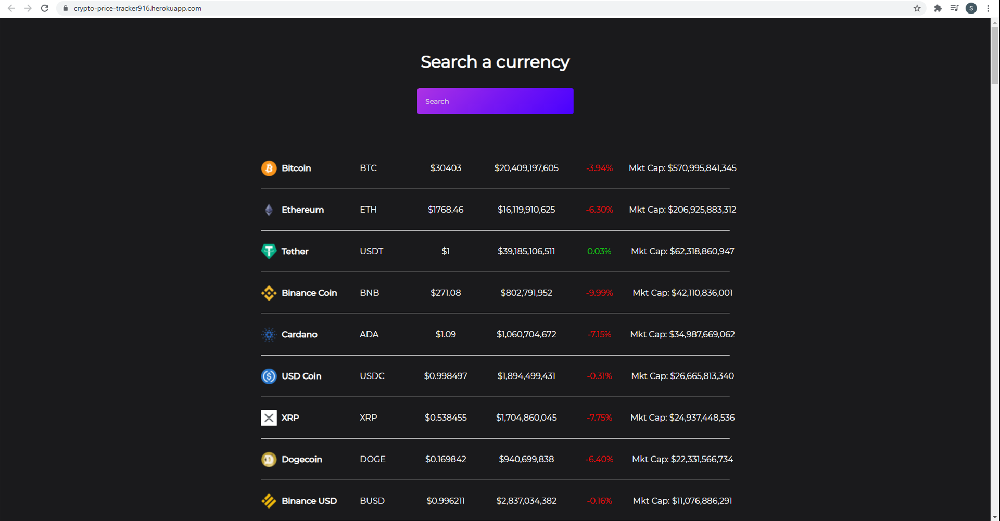

# Crypto-Price-Tracker

An app created using a React framework to display and allow the user to search different crypto currencies. 
The fields displayed are the following for each coin: name, image, symbol, price, volume, priceChange, and marketcap.
The price change will reflect whether the price has recently increased or decreased based on the color (red = down, green = up).

The app utilizes React Hooks, Axios, and coingecko API (https://www.coingecko.com).

Check it out at the following link: https://crypto-price-tracker916.herokuapp.com/

